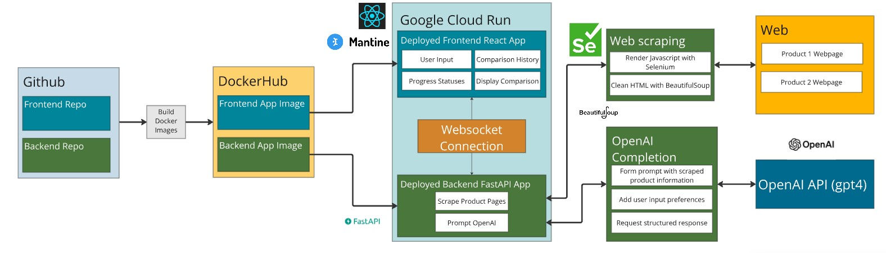

# Quibble (Frontend)-AI-Based Product Comparison Tool 

## Authors
- [D. Scott DiPerna](https://github.com/dscottd7)
- [Brendan Heinz](https://github.com/jbh14)
- [Xinrui Hou](https://github.com/superhermione)
- [Edward Mai](https://github.com/MaiEdward)

## Table of Contents
1. [Project Overview](#overview)
2. [Frontend Features](#product_features)
3. [Quibble Architecture](#quibble_architecture)
4. [Frontend Tech Stack](#tech_stack)
5. [Available Scripts](#scripts)
6. [Frontend Walkthrough](#walkthrough)
7. [Future Enhancements](#future_enhancement)
8. [Citations](#citation)

## Project Overview
Quibble is an AI-powered product comparison tool designed to streamline the process of comparing two products. Users can simply enter URLs for the products they wish to compare, along with specific preferences for the comparison factors. Quibble then handles the rest, leveraging its backend to gather product details and present insightful results.

The backend utilizes Selenium to scrape the necessary product information from the given web pages and uses OpenAI to generate a thorough comparison report, highlighting key features, pros, cons, and essential factors, enabling users to make well-informed purchasing decisions.

The Quibble frontend enhances the user experience by:
- Displaying the AI-generated comparison in a clear and structured manner.
- Offering a feature to save comparisons for future reference, providing convenience and easy access.
- Allowing users to quickly access the specific products mentioned within the comparison.

This README provides a comprehensive guide to setting up and understanding the Quibble frontend, which is built using React and Mantine UI components, and deployed on Goodgle Cloud. This application requires both the frontend and backend services to be running for proper functionality. 
- **You can access Quibble backend repo here: https://github.com/dscottd7/quibble-backend**
- **You can access the deployed site here:**
  
## Frontend Features
1. **Product Comparison with OpenAI API**:
   - Users can paste the URLs of two products to compare them.
   - OpenAI generates a structured comparison, displaying a detailed comparison summary with specific recommendations, and pros and cons for each product.
2. **Category Selection and Preferance**:
   - Users can select specific categories they want to compare (e.g., Price, Model, Features).
   - Users can add their input for comparison preferance. 
3. **Progress Monitoring**:
   - A visual progress bar is displayed during the product comparison process, providing real-time feedback to the user.
   - The progress bar shows the stages of comparison, ensuring that users are aware of the process and its completion status.
4. **Save Comparison Feature**:
   - Comparisons can be saved in the sidebar for future reference.
   - Users can clear all saved comparisons or delete individual ones.
5. **Product Title Display**:
   - Product URLs are linked to their respective product titles, which are extracted during the comparison.
   - This feature is integrated into both the comparison result box and the saved comparison history sidebar, making it easy for users to access product details directly.
6. **User-Friendly UI**:
   - Mantine components are used for enhanced styling and responsiveness.
   - The layout includes a main product comparison area and a sidebar for saved comparisons.

## Quibble Architecture

## Frontend Tech Stack
- **React: For building the user interface.**
- **Mantine UI: For beautiful and customizable UI components.**
- **WebSockets: To manage real-time communication with the backend OpenAI service.**
- **Local Storage: To store saved comparisons persistently across sessions.**
- **Google Cloud Platform: The application is deployed into Google Cloud though Docker Image**

## Available Scripts

Install the necessary dependencies:
`npm install`

In the project directory, you can run:
`npm start`

Runs the app in the development mode.\
Open [http://localhost:3000](http://localhost:3000) to view it in your browser.
- the backend service URL will default to `ws://localhost:8000/ws/compare/structured` (for local testing) unless a different URL is specified by setting `REACT_APP_WEBSOCKET_URL_STRUCTURED=<target_backend_url>` in a `.env` file in your working directory.
- **NOTE**: if building a docker image for local testing or deployment and overriding the default backend service URL per the instruction above, be sure that your are NOT ".dockerignore"-ing your `.env` file (React doesn't have direct access to runtime environment variables after build time). 

Launches the test runner in the interactive watch mode
`npm test`

## Frontend Walkthrough

* **Homepage walkthrough** - visually presents the user's operation in comparing two products.

## Future Enhancements
- User Authentication: Allow users to log in and save comparisons to their account.
- Multiple Product Comparison: Extend functionality to allow comparison of more than two products at once.
- Database Integration: Store users' saved comparisons in a database instead of local storage to support multiple devices and permanent access.
- User Feedback and Ratings: Allow users to rate the quality of a generated comparison.
- Real-time Chatbot Assistant: Integrate a Quibble chatbot to guide users for nevigating the site.
- Product Visual Integration: Enhance the comparison feature by scraping product images from relevant websites and displaying them in an organized, visually appealing way.

## Citations
- React Learning Guide. https://react.dev/learn
- Mantine Documentation. https://mantine.dev/
- OpenAI (n.d.). API Reference. OpenAI. https://platform.openai.com/docs/overview
- Google Cloud Deployment. https://cloud.google.com/sdk/gcloud/reference/app/deploy
- DockerHub. https://hub.docker.com/ 
